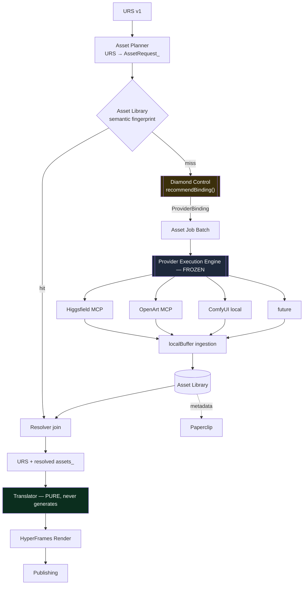

# Asset Generation Division — Architecture & Design Review

**Read-only audit · 2026-08-06 · No implementation**

---

## 0. The finding that should shape this milestone

You asked where Asset Generation should live. Before answering: **Mika already has two execution paths, and this milestone is about to create a third.**

| | Legacy dispatch path | Production Execution Engine |
|---|---|---|
| Entry | `lib/dispatch/executeDispatch.js` | `lib/production/execution/executionEngine.js` |
| Adapters | `adapters/*.adapter.js` (top level) | `lib/production/execution/adapters/*` |
| Storage | `content-artifacts/<lane>/<workflow>/<hex>.<ext>` | `production-artifacts/<Brand>/<jobId>/<hash>.<ext>` |
| Governance | Approval gate + budget guard | Approval, budget, queue, locks, retry, reconciliation |
| Callers | 6 | 14 |
| Status | **Real and working for images** | **Real and working for video** |

Both integrate OpenArt. `adapters/openart.adapter.js` does **image** generation via OpenArt MCP and is genuinely live — it powers Thumbnail Studio and package thumbnails, with model discovery, schema-driven params, credit estimation, budget guard, polling, and artifact download. `lib/production/execution/adapters/openartVideoMcp.adapter.js` does **video** through the same MCP server on the newer engine.

**So the answer to "does an Asset Library already partially exist?" is yes — and so does an asset generation pipeline. It is just on the wrong path.**

This reframes the milestone. Asset Generation is not a greenfield capability. It is largely a **consolidation**: take the image-generation capability that already works on the legacy path, move the responsibility onto the frozen engine, and put a planner and a cache in front of it.

> **Opinion: the single most valuable constraint for this milestone is a negative one — Asset Generation must not touch `executeDispatch`.** If it does, Mika will have three execution paths, two artifact stores, and no single answer to "what did this cost?" That is a far more expensive mistake than choosing the wrong model router.

---

## 1. Audit answers

### 1. What already exists that can be reused

| Reusable | Where | Note |
|---|---|---|
| Provider Execution Engine | `lib/production/execution/` | Queue, locks, retry, reconciliation, `localBuffer` ingestion. **Reuse unmodified.** |
| Higgsfield MCP adapter | `higgsfieldMcp.adapter.js` | `generate_image`, `generate_video`, `image_to_video`, `job_status`, `models_explore`. Accepts `model`, `negativePrompt`, `aspectRatio`, `durationSeconds`, `referenceArtifactIds`. |
| OpenArt MCP image surface | `lib/openart/openartMcpClient.js` | `openart_generate_image`, `openart_model_list`, **`openart_model_cost`**, `openart_model_form_get`, `text2image` |
| URS asset fields | `renderSpecSchema.js` | `assets[]` with `role`/`kind`; per-scene `generationPrompt`, `negativePrompt`, `assetKind` |
| Immutable hex-named artifact storage + safe serving | `saveImageArtifact.js`, `/api/image/artifacts/[id]` | Traversal-guarded, server-generated filenames |
| Model catalogs, live | `models_explore`, `openart_model_list` | Already surfaced through APIs with pickers |
| OSS adapter scaffolding | `adapters/comfyui.adapter.js`, `wan.adapter.js` | Staged; ComfyUI already has real HTTP code |

**`openart_model_cost` deserves attention.** OpenArt exposes a *pre-flight cost query per model*. Higgsfield does not. That single tool is the difference between "estimated spend" and "known spend before dispatch," and it should shape which provider Mika prefers for high-fan-out work.

### 2. Does anything duplicate this responsibility?

**Yes, materially.**

- Two execution engines (above).
- Two OpenArt integrations — image on legacy, video on the engine.
- Two artifact stores with different layouts and no shared identity.
- `adapters/higgsfield.adapter.js` (STAGED stub) duplicates `higgsfieldMcp.adapter.js` (real). Dead weight that will mislead.

Thumbnail generation is the clearest overlap: it is *already* asset generation — a prompt, a model, a negative prompt, a governed spend, an ingested image. It simply predates URS and lives on the old path.

**Recommendation:** treat the thumbnail pipeline as the **first migration target**, not a competitor. Once the Asset Division exists, thumbnails become one capability (`thumbnail_still`) among several, and the legacy path can be retired rather than maintained in parallel.

### 3. Where should Asset Generation live?

Between URS and Translation, as its own module — but conceptually **smaller than the word "Division" implies.**

> **Opinion: resist building a division. Build a resolver.**
> `resolveAssets(URS) → URS'`
> Everything else — planning, caching, dispatch, join — is implementation detail behind that one signature. The failure mode here is building a general workflow/DAG engine because fan-out feels like orchestration. It is not: it is one bounded fan-out with one join.

### 4. Should assets be stored separately from Production Jobs?

**Yes. This is not a close call.**

`productionArtifactStore` exports exactly `saveProductionArtifact`, `findProductionArtifactPath`, `getProductionArtifact`, `listProductionArtifactsForJob`. No content hashing for identity, no dedup, no reuse, no cross-job enumeration. Every path is keyed by job.

An artifact is a **terminal output of one job**. An asset is a **reusable input to many jobs**. Same bytes, opposite lifecycle. Retrofitting reuse into a frozen, load-bearing store to save a directory is a bad trade.

### 5. Does an Asset Library partially exist?

**Partially — the storage layer, not the library semantics.**

`content-artifacts/<laneId>/<workflowId>/<hex>.<ext>` gives immutable, hex-named, traversal-guarded files with a safe read API. What is missing is everything that makes it a *library*: content identity, semantic identity, dedup, capability tagging, brand scoping, lineage, quality signal, retention.

Also worth knowing: the directory currently holds **20 files, all markdown/JSON from one old viral workflow — no generated images at all.** The image pipeline is built and effectively unused. That is the same pattern M0 found with the Content Workforce: capability present, never switched on.

### 6. New execution layer, or reuse the engine?

**Reuse the Provider Execution Engine. No new execution layer. No exceptions.**

An asset generation job is exactly what the engine already handles: external, long-running, costly, pollable, artifact-producing. It already has approval, budget, queue, locks, retry, reconciliation, and `localBuffer` ingestion. Every one of those is needed here, and several are needed *more* than for rendering, because generation is a real purchase where a HyperFrames render is $0.

What Asset Generation adds is **above** the engine: fan-out, cache, join. Not beside it.

### 7. Does Higgsfield MCP eliminate future provider adapters?

**Largely yes for hosted models — and that is the most important structural fact in this design.**

Higgsfield MCP fronts 30+ models including Soul, Cinema Studio, Flux, Seedream, Kling, Minimax Hailuo, and Veo. Building separate adapters for Kling, Veo, Flux, or Seedream would duplicate an integration that is already merged.

> **Opinion: the routing dimension Mika is missing is MODEL-level, not PROVIDER-level.** Adding Veo 4 should be a catalog entry, not an adapter. This is what makes the architecture survive the next two years of model churn.

The caveat: an aggregator is a single point of dependency. If Higgsfield deprecates a model, changes pricing, or has an outage, every capability routed through it degrades together. That is an argument for keeping at least one *independent* path per critical capability — which is where open source earns its place.

### 8. Does OpenArt image generation belong in the same pipeline?

**Yes — and it should be the second binding wired, not a later phase.**

It is already real, already governed, already MCP-based, and it exposes `openart_model_cost`. Having two independent hosted image paths from day one is what proves the architecture is genuinely provider-agnostic. A router with one option is not a router; it is a hardcoded call with extra indirection.

### 9. How should assets be versioned?

> **Opinion: assets should never be versioned. They should be immutable, with lineage and variant sets.**

Generative output is non-deterministic. "v2 of this asset" is meaningless — a regeneration is a *different asset that serves the same request*. Mutating in place would silently change already-rendered videos.

Model it as:
- **Immutable asset** — written once, identified by `contentHash`, never edited.
- **Variant set** — N assets answering one `AssetRequest`; one is `selected`.
- **Lineage** — `derivedFrom` (image → `image_to_video`), `consistencyGroupId`, `supersedes`.
- **Request versioning** — the *request* carries a version (prompt, model, params, translator/planner version). Changing the request produces a new request identity, hence new assets, never a mutation.

### 10. How should URS reference assets?

Preserve URS's two invariants: provider-neutral, and deterministic-in → deterministic-out.

- Scene gains `assetRef` — an opaque `assetId` plus resolved `url`/`mimeType`.
- Top-level `assets[]` becomes the resolved manifest (it already exists and is currently write-only).
- **Provider and model never appear in URS.** They belong in the asset record's provenance, not in the render contract.
- `renderIntentSource`-style honesty: an unresolved asset stays `null` and is reported through `completeness.missing`, exactly as narration did before P3.

**Consequence to accept deliberately:** resolved assets change the URS content hash, therefore the composition ID. That is correct — a video with real footage genuinely is a different composition from one with gradients. The determinism contract is preserved; the input simply got richer.

### 11. How should Paperclip consume asset metadata?

Every asset record will already carry prompt, model, params, cost, and outcome. That is a training set by accident.

Phase it honestly:
1. **Record** (with the division) — free, creates the dataset.
2. **Suggest** (after ~100 assets) — Paperclip proposes prompt patterns or model preferences as a *hint* to Diamond Control's recommendation, never an override.
3. **Learn from outcomes** — requires published performance data, which Mika does not have. The earlier strategy audit found no attribution spine.

> **Opinion: do not build Phase 3 now.** "Best-performing visual style" is unmeasurable without attribution. Building the loop before the signal produces confident nonsense.

Note Paperclip is currently server-only config with a company/path model — it is an ingestion surface, not yet a learning system. Recording into the asset library is the right first step regardless.

### 12. How should Diamond Control influence model selection without coupling to providers?

**This is the best idea in your brief and it deserves to be the organizing principle.**

Today, Diamond Control is a 228-line client-side command router with risk classification (`external`, `paid`, `destructive`, `long-running`). There is no `lib/diamond` — no server-side policy module exists. So this is genuinely new construction, and it should be built as a **policy plane**, not a layer work flows through.

The separation:

| Question | Owner |
|---|---|
| *What assets must exist?* | Asset Generation |
| *Who should make this, with what model and params?* | **Diamond Control** |
| *Make it.* | Provider Execution Engine |

The Asset Division emits a capability request and receives an opaque binding:

```
AssetRequest  { capability, aspectRatio, durationSeconds, brandId, consistencyGroupId, prompt, negativePrompt, budgetCeiling }
                       │
                       ▼  Diamond Control: recommendBinding(request) → binding
ProviderBinding { providerId, model, params, estimatedCost, rationale, confidence, fallbacks[] }
```

**The rule that makes this real: the Asset Division must never `import` a provider module, never name a provider in a conditional, and never read a provider catalog.** It treats `providerId` as an opaque string it forwards to the engine. A validator can enforce this the same way `validate-render-spec` enforces URS provider-neutrality today — that check already exists and works.

If OpenArt becomes better next year, or Veo 4 arrives through Higgsfield MCP, only Diamond Control's catalog and policy change. The Asset Division does not recompile.

---

## 2. Proposed architecture



**Boundaries, stated as invariants:**

1. Asset Generation never imports a provider. ← enforceable by validator
2. The translator never generates. ← already true; must stay true
3. All generation goes through the frozen engine. ← no third path
4. Diamond Control decides; it is never something work flows *through*.
5. Capability vocabulary is Mika's (`cinematic_broll`, `product_still`, `background_plate`, `motion_reference`, `thumbnail_still`) — never `kling_v2_pro`.

---

## 3. Open source — an opinion you should push on

You said you are open to OSS. I think it is more than an option; it is the **cost floor and the consistency story**, and Mika already has a staged `comfyui.adapter.js` with real HTTP code.

| | Hosted (Higgsfield / OpenArt) | ComfyUI local |
|---|---|---|
| Marginal cost | Credits (~$1/16 credits) | **$0** |
| Quality ceiling | Higher today | Good, improving |
| Determinism | Non-deterministic | **Seeded — reproducible** |
| Character consistency | Reference images | **LoRA — genuinely trainable** |
| Rate limits / outages | Yes | None |
| Brand/IP exposure | Leaves the machine | **Stays local** |
| Speed on Apple silicon | Fast (remote GPU) | Slow for video, workable for stills |

**Recommended split:**

- **Drafts, iterations, background plates, style exploration → ComfyUI.** These are exactly the high-volume, low-stakes generations where credit burn is worst and quality matters least.
- **Hero shots and final b-roll → hosted.** Quality ceiling matters; volume is low.
- **Character/product consistency → OSS LoRA.** This is the strongest argument. Hosted reference-image conditioning is approximate and per-call; a trained LoRA gives *durable* identity across scenes, videos, and months. My previous audit proposed consistency groups via `referenceArtifactIds` — **I now think that is the weaker option** and OSS LoRA is the right long-term primitive.

A seeded local generator also gives something no hosted model can: a **reproducible** asset. Same prompt + same seed + same model = same bytes. That makes the asset cache exact rather than semantic, and makes validators able to assert on generation without spending.

**Caveat, honestly:** video generation on a Mac is slow enough to be impractical for 7-scene fan-out today. Recommend OSS for **images first**, hosted for video, and revisit.

---

## 4. Data model

```
AssetRequest
  requestId, capability, brandId
  prompt, negativePrompt, aspectRatio, durationSeconds
  consistencyGroupId?, derivedFromAssetId?
  semanticFingerprint          normalized(prompt+negative+aspect+duration+capability+plannerVersion)
  budgetCeiling, priority
  sourceUrsId, sourceSceneIndex

ProviderBinding                 ← returned by Diamond Control, opaque to the division
  providerId, model, params
  estimatedCost { amount, currency, estimateType }
  rationale, confidence, fallbacks[]
  policyVersion

Asset                           ← immutable
  assetId, capability, brandId
  contentHash, semanticFingerprint
  storagePath (project-relative), mimeType, sizeBytes, durationSeconds?, width, height
  provenance { providerId, model, params, providerJobId, productionJobId, promptHash, seed?, generatedAt }
  cost { estimated, actual, currency, confirmed }
  lineage { derivedFromAssetId?, consistencyGroupId?, supersedes? }
  quality { operatorRating?, reviewVerdict?, usageCount, lastUsedAt }
  policy { brandApproved, retentionClass }

AssetPlan                       ← persisted aggregate; the fan-out/join unit
  planId, ursId, packageId, status
  requests[], bindings[], jobIds[], resolvedAssetIds[]
  budget { ceiling, estimatedTotal, actualTotal }
  approval { required, approvedAt, approvedBy }
```

**Two-tier identity is the load-bearing decision.** `contentHash` answers *are these the same bytes?*; `semanticFingerprint` answers *would regenerating this produce an equivalent asset?* Because hosted models are non-deterministic, content hashing alone can never produce a cache hit. The semantic fingerprint is what saves money — and it should be deliberately lossy, surfacing near-misses for operator confirmation rather than reusing silently.

---

## 5. Asset lifecycle

```
planned → cache-checked → bound (Diamond Control) → approved (batch) →
queued → generating → ingested → reviewed → selected → reusable → retired
```

Failure and reuse paths that must exist:
- **cache hit** → skips straight to `reusable`, cost $0
- **generation failure** → falls back to `binding.fallbacks[]`; if exhausted, the request resolves `null` and the translator renders a placeholder, reporting it in `degradedFields`. **Honest degradation, never a hidden retry-purchase.**
- **rejected on review** → asset retained (it cost money and is training signal), marked `brandApproved: false`, excluded from cache hits
- **retired** → retention class expiry; b-roll for one video is not long-lived, background plates and LoRAs are

---

## 6. Caching, cost, governance

**Cache** — check before binding, so a hit never consults Diamond Control or the engine. Scope keys by `brandId` (brand look should not leak between brands) and `capability`. Track hit rate as a first-class metric; it is the direct measure of whether the library pays for itself.

**Cost** — fan-out is the real risk. Seven scenes × variants × retries turns a $0 render into an unbounded purchase.
- Budget ceiling on the **AssetPlan**, enforced before dispatch, not per job.
- Prefer providers exposing pre-flight cost (`openart_model_cost`) for high-fan-out work.
- Draft tier (OSS/cheap) vs final tier (hosted/premium) as a policy dimension.
- Surface **credit balance** — Higgsfield credits are prepaid and exhaustible; running out mid-campaign is foreseeable and preventable.

**Governance** — the P0–P3 audits found one video already passing **six** approval surfaces. Naive per-asset approval would add twenty more.

> **Opinion: gate the batch, sample the assets.** One approval for an AssetPlan with a known ceiling; spot-review individual assets. Block only on brand/safety, never on a quality score. Decide this before the first asset is generated — retrofitting a batch gate after per-asset gates exist is painful.

---

## 7. Folder structure

```
lib/production/assets/
  assetCapabilities.js     Mika's capability vocabulary (pure)
  assetRules.js            pure: fingerprint, validation, retention, cost policy
  assetPlanner.js          URS → AssetRequest[]
  assetLibraryStore.js     fs-backed sibling of productionArtifactStore
  assetResolver.js         plan → cache → bind → dispatch → join → URS'
lib/diamond/
  policyRules.js           pure: capability → candidate bindings, brand policy
  recommendBinding.js      the PDP entry point
  modelCatalog.js          discovered via models_explore / openart_model_list

data/asset-plans/          plan records        (gitignored)
data/assets/               asset records       (gitignored)
assets-library/<brand>/<capability>/<assetId>/   binaries (gitignored)

scripts/validate-asset-planner.mjs
scripts/validate-asset-library.mjs
scripts/validate-diamond-policy.mjs
scripts/validate-asset-provider-neutrality.mjs   ← enforces invariant #1
```

---

## 8. Roadmap

**M1 — one real generated scene** (detailed below)
**M2 — Asset Library + fingerprint + cache** — before fan-out, or the first bill will be a surprise
**M3 — Asset Planner fan-out + batch budget gate + translator consumes `assets[]`**
**M4 — Diamond Control policy plane; second binding (OpenArt) proves neutrality**
**M5 — ComfyUI local binding; draft/final tiering**
**M6 — consistency (LoRA or reference groups)**
**M7 — Mission Control surfaces: Generation Queue with *model*, cache-hit rate, credits**
**M8 — migrate thumbnails off `executeDispatch`; retire the legacy path**
**M9 — Paperclip recording**

---

## 9. Risks

| Risk | Severity | Mitigation |
|---|---|---|
| **Third execution path** | **Highest** | Hard rule: engine only. Validator-enforced. |
| Cost fan-out | High | Plan-level ceiling before dispatch; cache-first |
| Approval fatigue | High | Batch gate designed up front |
| Determinism loss in translator | High | Translator never generates — already enforced |
| Aggregator dependency (Higgsfield) | Medium | Keep ≥1 independent path per critical capability (OpenArt, ComfyUI) |
| Quality regression vs. honest gradients | Medium | Per-scene opt-in; placeholder stays the fallback |
| Library unbounded growth | Medium | Retention classes at design time |
| Rebuilding a workflow engine | Medium | It is a resolver, not a DAG engine |

---

## 10. Things NOT to build

1. A Supercomputer provider adapter (no agent API; and it competes with Mika's own division).
2. Separate adapters for Kling / Veo / Flux / Seedream — route by **model** through existing MCPs.
3. Generation inside the translator.
4. A third execution path — including "just for assets."
5. Reuse retrofitted into `productionArtifactStore`.
6. Per-asset approval gates by default.
7. Asset *mutation* / in-place versioning.
8. Paperclip outcome-learning before an attribution spine exists.
9. A general workflow/DAG engine.
10. Provider names anywhere inside the Asset Division.
11. Music. Nothing upstream produces music intent.

---

## 11. M1 — the smallest milestone that validates the architecture

**Objective:** one real generated image replaces one gradient in the already-rendered Digital Diamond AI video.

Use the asset that already exists in URS scene 0:

```
generationPrompt "A cluttered desk with various automation tools, including a laptop,
                  papers, and coffee cup, in a well-lit modern office setting."
negativePrompt   "No people, no mess, clean desk."
assetKind        "video"   → capability: background_plate (still)
aspectRatio      9:16
```

**In scope**
- `capability` vocabulary with exactly one entry: `background_plate`
- A stub `recommendBinding()` returning a **hardcoded** binding for Higgsfield `generate_image` — *shaped as a returned value, never an import*
- One asset job through the **existing** Execution Engine, with approval and budget
- Minimal asset record + storage (no cache, no dedup)
- URS scene 0 gains `assetRef`; `assets[]` gains one entry
- Template v4: one image layer behind the headline, `src` a fixed relative constant
- Render, verify the plate appears

**Explicitly out of scope:** planner, fan-out, cache, fingerprinting, real policy, OpenArt binding, ComfyUI, consistency, Paperclip, Mission Control UI.

**Why the stub binding is the point.** M1's job is to prove the *seam*, not the intelligence. If `recommendBinding()` returns a hardcoded value but the Asset Division consumes it as opaque data and imports nothing provider-shaped, then M4 replaces the stub's body and nothing else moves. That is the whole architecture, validated for the price of one image.

**Success criteria**
- One image generated through the frozen engine — no new execution path
- `grep -i 'higgsfield\|openart' lib/production/assets/` returns **zero** matches in executable code
- Asset stored outside `production-artifacts/`
- Rendered MP4 shows the plate; still 1080×1920 / 30fps / 45.0s with narration intact
- Translator remains pure and deterministic
- All existing validators still pass (currently 611/611)

**Expected cost:** one Higgsfield image generation — single-digit credits, roughly a few cents.

M1 is deliberately trivial. The pattern that has held across M0–P3 is that real problems (the corrupted `.next` cache, the review deadlock, the font-lint abort, the validator that deleted a live composition) were found by running the smallest real thing — never by designing.

---

## Summary

Asset Generation is **not** greenfield: a working image-generation pipeline already exists on the legacy dispatch path, with a partial artifact store beneath it. The milestone is consolidation plus a planner and a cache — and its most valuable constraint is refusing to create a third execution path.

Your instinct to have the Asset Division *ask* Diamond Control rather than route internally is the right call, and better than the capability-router-inside-the-division I proposed previously. It produces a clean policy-decision / policy-enforcement split where the division can be validated to contain zero provider knowledge — mechanically, the same way URS neutrality is validated today.

And on open source: it is not the budget option. Seeded reproducibility and trainable LoRAs solve two problems — exact caching and durable character consistency — that hosted APIs structurally cannot.
