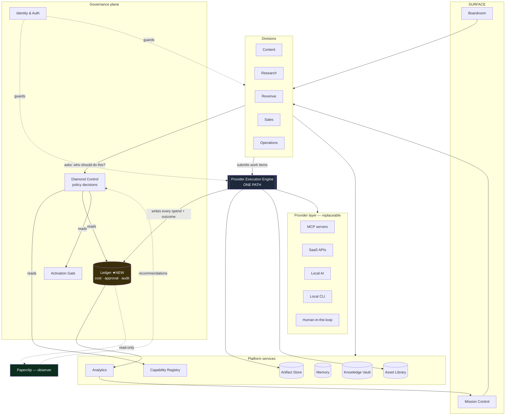

# Mika OS — Operating System Architecture Freeze

**Read-only architecture review · 2026-08-06 · No implementation**

---

## 0. The finding that determines what must be frozen

Mika already has an operating system. It exists in fragments, and **its governance layer is split three ways across two execution paths.**

| Governance system | Covers | Blind to |
|---|---|---|
| `lib/cost/costEngine.js` | `logs/dispatch-log.json` (legacy path) | `production-jobs`, `publish-jobs`, hyperframes, narration — **all of it** |
| `lib/activation/activationGate.js` | staged → active provider promotion | Never consulted by the Production Execution Engine |
| Per-job `budget`/`approval` blocks | Production Execution Engine only | Legacy dispatch, thumbnails, narration |

Verified: `costEngine` contains no reference to `production-jobs`, `productionJob`, `executionEngine`, `publish-jobs`, `hyperframes`, or `narration`. **Every video Mika has ever rendered is invisible to Cost Intelligence.** The Activation Gate is consumed only by its own API routes and the executive briefing — the engine uses its own `*Availability` checks instead.

So the honest current state is:

- Two execution paths (`executeDispatch`, `executionEngine`)
- Two artifact stores (`content-artifacts/`, `production-artifacts/`)
- Three partial governance systems, none of which sees the whole
- No single answer to *"what did this cost, and who approved it?"*

Asset Generation is about to become a **fourth** spend source. If it lands before this is frozen, Mika will have four spend sources and still no ledger.

> **This is the architectural decision to freeze first, and it is not the one the brief asks about.** Provider replaceability, MCP placement, and division boundaries are all tractable later. A missing ledger becomes unfixable once five divisions depend on their own accounting.

---

## 1. What already exists (and is already platform)

The good news: the bones are there, and several are well built.

| Existing | Location | Platform-grade? |
|---|---|---|
| Capability Registry | `capabilities/capability-registry.json` (`schemaVersion` + `records`) | **Yes** — proper registry shape |
| Agent Registry | `agents/agent-registry.json` | **Yes** |
| Activation Gate | `lib/activation/activationGate.js` | **Yes** — provider-agnostic promotion flow |
| Cost Engine | `lib/cost/costEngine.js` | Partly — right idea, wrong scope |
| Memory | `memory/<laneId>.json` | Partly — lane-scoped, not OS-scoped |
| Orchestration read layer | `lib/orchestration/workflowRules.js` | **Yes** — explicitly read-only, never mutates |
| Auth | `middleware.js` — admin token, origin allowlist | **Yes** |
| Provider Execution Engine | `lib/production/execution/` | **Yes** — the strongest component in the system |
| Artifact storage | `productionArtifactStore`, `saveImageArtifact` | Partly — two stores, no shared identity |

**The job is consolidation, not invention.** Roughly 70% of the OS layer exists; it is misfiled and inconsistently consumed.

Two conventions already hold across the codebase and should be elevated to law, because they are why the last four milestones went cleanly:

1. **Pure `*Rules.js`** — no I/O, importable from server and client. Policy is data + pure functions.
2. **One executable validator per subsystem** — `scripts/validate-*.mjs`, real code against real data, no mocking. 611 checks currently pass. This is Mika's actual quality mechanism and it should be a requirement for every new platform service.

---

## 2. Final Mika OS hierarchy

```
┌─ SURFACE ────────────────────────────────────────────────┐
│  Mission Control          the executive view              │
│  Boardroom                strategy / multi-agent planning  │
└───────────────────────────────────────────────────────────┘
┌─ GOVERNANCE PLANE (lateral — work never flows through) ──┐
│  Diamond Control          policy decisions                 │
│  Ledger                   cost + approval + audit  ★NEW    │
│  Activation Gate          provider promotion               │
│  Identity & Auth                                           │
└───────────────────────────────────────────────────────────┘
┌─ DIVISIONS (domain logic — replaceable, additive) ───────┐
│  Content · Research · Revenue · Sales · Operations · …     │
│    each: intake → plan → work items → outputs             │
└───────────────────────────────────────────────────────────┘
┌─ PLATFORM SERVICES (shared, domain-free) ────────────────┐
│  Capability Registry · Asset Library · Artifact Store      │
│  Memory · Knowledge Vault · Analytics · Scheduling         │
└───────────────────────────────────────────────────────────┘
┌─ EXECUTION ──────────────────────────────────────────────┐
│  Provider Execution Engine       ONE path, no exceptions   │
└───────────────────────────────────────────────────────────┘
┌─ PROVIDER LAYER (fully replaceable) ─────────────────────┐
│  MCP · SaaS API · Local AI · CLI · Human-in-the-loop       │
└───────────────────────────────────────────────────────────┘
┌─ LEARNING (observer — reads everything, drives nothing) ─┐
│  Paperclip                                                 │
└───────────────────────────────────────────────────────────┘
```

**Two deliberate departures from the hierarchy in the brief:**

1. **Governance is a lateral plane, not a layer work passes through.** The brief's chain (`Mission Control → Boardroom → Diamond Control → Content Division → …`) implies every action transits Diamond Control. That structurally recreates the approval-fatigue problem the P0 audit already found — one video passing six gates. Governance *constrains* execution; it must not *carry* it.

2. **Learning sits outside and below, reading the Ledger.** Not between divisions and execution.

---

## 3. System dependency graph



**Note the shape of the arrows.** Divisions *ask* Diamond Control and *submit to* the engine. Nothing routes through governance. Paperclip only reads, and only ever emits recommendations Diamond Control may ignore.

---

## 4. Answering the twelve questions

### Q1 — Core permanent OS components

The smaller this list, the longer it survives. Nine:

| # | Component | Contract |
|---|---|---|
| 1 | **Identity & Auth** | Every mutation is authenticated and attributed |
| 2 | **Capability Registry** | Mika's vocabulary of *what can be done*, provider-free |
| 3 | **Diamond Control (Policy)** | `question → decision`. Never dispatches |
| 4 | **Ledger** ★ | Every spend, approval, and outcome, one schema, one place |
| 5 | **Provider Execution Engine** | The only way external work happens |
| 6 | **Artifact Store** | Terminal outputs, job-scoped, immutable |
| 7 | **Asset Library** | Reusable inputs, content + semantic identity |
| 8 | **Memory** | Durable operational context, scoped |
| 9 | **Surface (Mission Control)** | Reads everything, owns nothing |

Everything else is a division or a platform convenience.

### Q2 — Platform services vs department code

**Platform** (domain-free, no division may fork them): Auth, Capability Registry, Diamond Control, Ledger, Execution Engine, Artifact Store, Asset Library, Memory, Knowledge Vault, Analytics, Scheduling, Notification.

**Division code** (domain-specific): Content Workforce, URS, HyperFrames translator, narration, research adapters, lead scoring, invoicing, publishing.

**The test:** *would a second division need this, with different domain nouns?* Cost tracking — yes, platform. URS — no, content-specific.

**Reclassifications required:**

| Currently | Should be | Why |
|---|---|---|
| `lib/cost/costEngine.js` | Platform → **Ledger** | Must cover all execution, not one path |
| `lib/production/execution/` | Platform (path is misleading) | It is the OS execution layer, not a Content sub-module |
| `memory/<laneId>.json` | Platform, rescoped | Lane-scoped only; needs OS scope |
| `adapters/` (legacy, top-level) | **Retire** | Duplicate execution path |

The Execution Engine living under `lib/production/` is the clearest filing error. Physical relocation is optional; **conceptual reclassification is not.** Asset Generation, Sales outreach, and Operations automation will all depend on it, and none of them are "production."

### Q3 — Content Division vs OS

**Content Division owns:** Content Request, Workforce stages, Content Package, Render Intent, URS, HyperFrames translator, narration, publishing rules.

**The OS owns:** the engine, Ledger, policy, capability registry, asset library, artifact store, memory, surface.

**URS is the sharpest case, and it belongs to Content.** It is provider-neutral, which makes it *feel* like platform. But it is a *render* contract — it means nothing to a Sales division. The generalizable pattern is not URS itself; it is the *shape*: **every division should produce a neutral, versioned, validated intermediate representation before execution.** That pattern is platform. The specific IR is not.

### Q4 — Should Diamond Control be the universal orchestration brain?

**Universal: yes. Orchestration brain: no.** I'd push back on the framing.

An "orchestration brain" decides sequence and drives work. To do that for Revenue it must understand invoices; for Sales, pipelines; for Content, packages. Within a year it is a god object coupled to every domain, and it is on the critical path of every action.

**Diamond Control should be the universal *policy plane*: a stateless decision point answering bounded questions.**

| Question | Answer |
|---|---|
| Who should perform capability X for brand B? | `ProviderBinding` |
| Is this action allowed? | allow / deny / needs-approval |
| What is the budget ceiling? | limit + tier |
| Should this retry? | policy |
| Is this brand-compliant? | verdict |

Its vocabulary is **capability, cost, risk, brand** — never `ContentPackage` or `Invoice`. That keeps it thin forever, and it is the only version that scales to divisions not yet imagined.

Today it is a 228-line client-side command router with risk classes (`external`, `paid`, `destructive`, `long-running`) and **no server-side module** — `lib/diamond` does not exist. Those four risk classes are, notably, already the right primitive.

### Q5 — Should Paperclip learn across the whole OS?

**Yes — as a strict observer.**

The Ledger gives it one uniform substrate: every action, cost, approval, and outcome across every division, in one schema. That is a far better training surface than per-division hooks.

**The invariant: Paperclip may read everything and drive nothing.** It emits recommendations; Diamond Control may consult or ignore them. The moment a learning system can act directly, the system becomes unauditable — you can no longer answer "why did this happen?" with a policy, only with a model.

Phasing stays as previously argued: **record → suggest → learn from outcomes**, and the third phase remains blocked on an attribution spine that does not exist.

### Q6 — How future divisions plug in without coupling

Freeze one **Division Contract**. A division is anything expressible as:

```
Intake  →  Plan  →  Work Items  →  Governed Execution  →  Outputs  →  Ledger
```

| Rule | Meaning |
|---|---|
| Divisions never import providers | Enforceable by validator |
| Divisions never import each other | Compose at the surface, or via Memory/Ledger |
| Divisions ask Diamond Control | Never route themselves |
| Divisions submit to the engine | Never execute directly |
| Divisions own a versioned IR | Their URS-equivalent |
| Divisions ship a validator | `scripts/validate-<division>.mjs` |

Revenue and Sales already exist in embryo (`leads`, `offers`, `clients`, `revenue`, `proposals` with real stores and CRUD). They are pre-contract: no IR, no engine use, no Ledger entries. Retrofitting them is the cheapest possible test of whether the contract is real.

### Q7 — Replaceable providers with preserved governance

Three mechanisms, all partly present:

1. **Capability indirection.** Divisions request capabilities; policy resolves to `(providerId, model, params)`. The binding is an **opaque returned value**, never an import.
2. **Adapter contract.** The engine's existing shape — `healthCheck`, `validateInput`, `estimate`, `submit`, `poll`, `cancel` — already abstracts MCP, local CLI, and manual export. It works. Do not change it.
3. **Activation Gate.** Staged → active promotion already exists and is provider-agnostic. **It should become a precondition the engine enforces**, not a parallel system. Today the engine uses its own availability checks and never consults it.

Governance survives provider swaps because it attaches to the **capability and the spend**, not the vendor.

### Q8 — Where do MCP servers fit?

**Inside the provider layer, as one transport class. Nothing more.**

MCP is currently fashionable and Mika has four MCP integrations, which creates a real risk of treating MCP as architecture. It is not — it is a wire format. The adapter contract must never assume MCP semantics (tool discovery, OAuth session, tool naming). `manualExport.adapter.js` and `hyperframes.adapter.js` already prove the contract works for non-MCP; keep it that way.

One caveat worth naming: an MCP aggregator like Higgsfield fronting 30+ models is a **single point of dependency**. If it deprecates a model or has an outage, every capability routed through it degrades together. Keep at least one independent path per critical capability.

#### Q8.1 — When a provider offers BOTH a REST API and an MCP server

**Take the REST API. This is frozen.**

The decision was forced by Kie.ai, which has a plain Bearer-key REST API *and* a third-party MCP server + CLI ([felores/kie-cli-mcp](https://github.com/felores/kie-cli-mcp)). Mika uses the **direct REST adapter**, permanently. The MCP server is not, and will not become, an execution path.

The general rule this settles: **MCP is justified only when it is the sole governed route into an account.** Higgsfield and HeyGen qualify — OAuth through the user's session is the only way in. A vendor with a working API key does not qualify; routing it through MCP wraps an API we already call and imports four problems:

| Problem | Why it breaks the architecture |
|---|---|
| **One tool per model** (`nano_banana_image`, `veo3_generate_video`) | Moves model selection into the **transport**, where policy cannot reach it. Providers are stable; models change; **Diamond Control owns that mapping** via the ProviderBinding. |
| **Its own SQLite task database** | A **second task history** competing with Production Jobs + Ledger. Spend tracking fragments; the Ledger stops being the single source of truth. |
| **Blocking completion** (`wait_for_task`) | The engine is deliberately asynchronous: `submit() → taskId → poll() → ingest`. |
| **No balance endpoint** | Loses a capability the direct API already provides. |

**Two planes, and they must not touch:**

```
Developer / Agent plane          │  Mika Runtime plane
  Claude · Hermes · OpenClaw     │    Diamond Control      (chooses)
  Diamond (dev assistant)        │      ↓
        ↓                        │    Execution Engine     (executes)
  (optional) Kie MCP Server      │      ↓
        ↓                        │    Direct REST Adapter
  prompt experimentation         │      ↓
  model discovery                │    Ledger               (records)
  capability exploration         │      ↓
  debugging, schema comparison   │    Asset Library        (preserves)
        ↓                        │
  NEVER spends on Mika's behalf  │  ALL production spend
```

The MCP server is genuinely useful on the left — prompt experimentation, model discovery, comparing parameter schemas. It must never appear on the right.

#### Q8.2 — Provider records are temporary; Mika's are permanent

Two expiry windows found during the Kie audit, and they generalise:

- **Result download URLs expire quickly** (~10 minutes for Kie). Artifacts are downloaded on the poll that first observes success — not later.
- **Remote task history is temporary** (~14 days for Kie), after which the provider can no longer answer for a task at all.

So a provider's task list is a **diagnostic convenience with an expiry date**, never a record. Mika's permanent record is:

> **Production Job → Ledger → Asset Library**

If a fact will matter after the fact, it must already be in Mika's own records before the provider's copy ages out. This is why `creditsConsumed` is captured at poll time rather than reconciled later.

### Q9 — Where does local AI fit?

**Provider layer — same contract, different economics.**

| Property | Local (ComfyUI, Ollama, Wan) | Hosted |
|---|---|---|
| Marginal cost | **$0** | credits |
| Determinism | **Seeded, reproducible** | non-deterministic |
| Privacy | **Nothing leaves the machine** | leaves |
| Rate limits | none | yes |
| Quality ceiling | lower today | higher |

Local AI is not the budget option — it is a **different capability class**. Seeded reproducibility makes caching exact rather than semantic; trainable LoRAs give durable character identity that reference-image conditioning cannot. Those are architectural advantages, not savings.

Staged adapters already exist (`comfyui.adapter.js` with real HTTP code, `wan.adapter.js`). **They must be re-homed onto the engine, not activated on the legacy path.**

Policy dimension worth freezing now: **draft tier vs final tier**. Local for iteration, hosted for hero output.

### Q10 — Where do external SaaS providers fit?

Same provider layer. They differ only in what governance must track: credentials (never in records), credits/quota (exhaustible — surface the balance), rate limits, latency, ToS constraints, and data residency. All of that belongs in the adapter and the Ledger, none of it in a division.

### Q11 — Where do future autonomous agents fit?

**This is the highest-stakes long-term question in the brief.**

An autonomous agent is not a new layer. It is **an actor that submits work through the same governed path a human uses.**

```
Human  ─┐
Agent  ─┼→ Division intake → Policy → Execution Engine → Ledger
Cron   ─┘
```

> **Freeze this now: no actor may spend, publish, or mutate outside the Ledger and the Execution Engine — regardless of autonomy.**

An agent that can call a provider directly is indistinguishable from a bug that spends money. The Ledger's `actor` field is what makes autonomy safe: every entry says whether a human, an agent, or a schedule caused it, and under which policy. Add that field before agents exist, not after.

Mika already has agent infrastructure (`agents/agent-registry.json`, `AgentWorkspace`, dispatch) built on the **legacy path** — which is precisely the un-ledgered route. Re-homing that is part of retiring `executeDispatch`.

### Q12 — Cleanest 5-year hierarchy

The hierarchy in §2, with this trajectory:

- **Year 1** — one execution path, one Ledger, Content + Asset Generation on-contract
- **Year 2** — Revenue/Sales/Ops retrofitted to the Division Contract; policy plane real
- **Year 3** — agents as first-class ledgered actors; Paperclip suggesting
- **Year 5** — divisions are plugins; providers are swappable; the OS layer has not materially changed

**The test of success is boring: adding a division in year 4 should require zero changes to the OS layer.**

---

## 5. Layer contracts

**Execution layer** — one path. `healthCheck / validateInput / estimate / submit / poll / cancel`. Every execution writes a Ledger entry. No division may execute directly. No second dispatcher, ever.

**Governance layer** — policy is pure functions over data. Decisions are returned values, never side effects. Approval gates the *batch*, not every item. Every spend has a pre-flight estimate and a post-hoc actual, and `estimateType` distinguishes `confirmed` from `provisional` — a discipline the narration and HyperFrames adapters already model correctly.

**Memory layer** — three scopes, deliberately separated: **operational** (lane/division state, exists today), **institutional** (brand voice, policy, durable facts), **episodic** (what happened — the Ledger). Do not merge them; they have different retention, privacy, and access needs.

**Learning layer** — read-only over the Ledger. Emits recommendations with provenance and confidence. Never in the execution path.

**Provider layer** — fully replaceable. Provider names appear *only* here. Enforceable: `grep -i '<provider>' lib/<division>/` must return zero matches in executable code — exactly how URS neutrality is validated today.

---

## 6. Architectural principles that must never be violated

1. **One execution path.** All external work goes through the Provider Execution Engine.
2. **One Ledger.** Every spend, approval, and outcome, in one schema.
3. **Divisions never import providers.** Capability in, opaque binding out.
4. **Policy decides; it never dispatches.** Governance is lateral, never a pipe.
5. **Transforms stay pure.** Translators/renderers never generate, never spend, never call the network.
6. **Learning observes; it never acts.**
7. **Capability vocabulary is Mika's**, never a vendor's.
8. **Honest degradation.** Missing input yields a reported gap, never a fabricated value or a hidden purchase.
9. **Immutable outputs.** Assets and artifacts are written once; regeneration creates new identity.
10. **Every subsystem ships an executable validator.**
11. **Registries are data, discovered where possible.**
12. **Every actor is attributed** — human, agent, or schedule.

Principles 5, 8, and 10 are already live and are why P0–P3 held together. The rest are the extension.

---

## 7. Decisions to freeze before Asset Generation M1

Ordered by cost-of-late-change.

| # | Freeze | Why now |
|---|---|---|
| **F1** | **One execution path.** Asset Generation uses the engine. `executeDispatch` is legacy and closed to new work. | A third path is close to unfixable once two divisions depend on it. |
| **F2** | **The Ledger record shape** — `actor`, `division`, `capability`, `providerId`, `model`, `estimated`, `actual`, `approvalRef`, `outcome`, `timestamp`. Schema only; implementation may lag. | Asset Generation is a *new spend source*. Retrofitting accounting across four sources is the expensive version. |
| **F3** | **Divisions never import providers**, with a validator proving it. | Trivial now; a rewrite in year 2. |
| **F4** | **Policy returns bindings; it never dispatches.** | Defines whether Diamond Control stays thin or becomes a god object. |
| **F5** | **Capability vocabulary is Mika's**, and is registry data. | Every future division inherits it. |
| **F6** | **Storage split:** artifacts = terminal + job-scoped; assets = reusable + library-scoped, identified by `contentHash` + `semanticFingerprint`. | Wrong choice here contaminates every future asset. |
| **F7** | **Assets are immutable.** No in-place versioning; lineage and variant sets instead. | Mutation would silently change already-rendered videos. |
| **F8** | **Batch approval, not per-item.** | Six gates already exist; naive per-asset approval adds twenty and kills throughput. |
| **F9** | **Actor attribution on every action**, before autonomous agents exist. | Adding it after agents can spend is a security incident, not a refactor. |
| **F10** | **Activation Gate becomes an engine precondition**, not a parallel system. | Two provider-status systems will drift. |

**F1 and F2 are the two that genuinely cannot wait.** The rest are cheap now and merely expensive later; those two become structural.

---

## 8. What NOT to build

1. A second/third execution path — including "just for assets."
2. Diamond Control as an orchestrator that work flows through.
3. A general workflow/DAG engine.
4. Per-item approval gates by default.
5. Provider names inside divisions.
6. Paperclip outcome-learning before attribution exists.
7. A microservice split. Mika is a single-operator local system; process boundaries would add failure modes and remove none.
8. An event bus / CQRS layer. The Ledger is an append-only log; that is sufficient and inspectable.
9. Cross-division imports.
10. Provider-specific columns in platform schemas.
11. Rebuilding what exists — `activationGate`, `capability-registry`, and `workflowRules` are sound; consolidate, don't replace.

---

## Summary

Mika does not need an operating system built. **It needs the one it already has consolidated and given a ledger.**

The capability registry, activation gate, execution engine, orchestration read layer, auth, and memory all exist and are largely well designed. They are misfiled, inconsistently consumed, and split across two execution paths — and the accounting layer is blind to every video Mika has ever produced.

Freeze **F1 (one execution path)** and **F2 (the Ledger record shape)** before Asset Generation M1. Both are cheap today. Both become structural once a second division starts spending.

On Diamond Control specifically: make it the universal **policy plane**, not the universal orchestration brain. A decision point stays thin for five years. An orchestrator becomes a god object in one.
