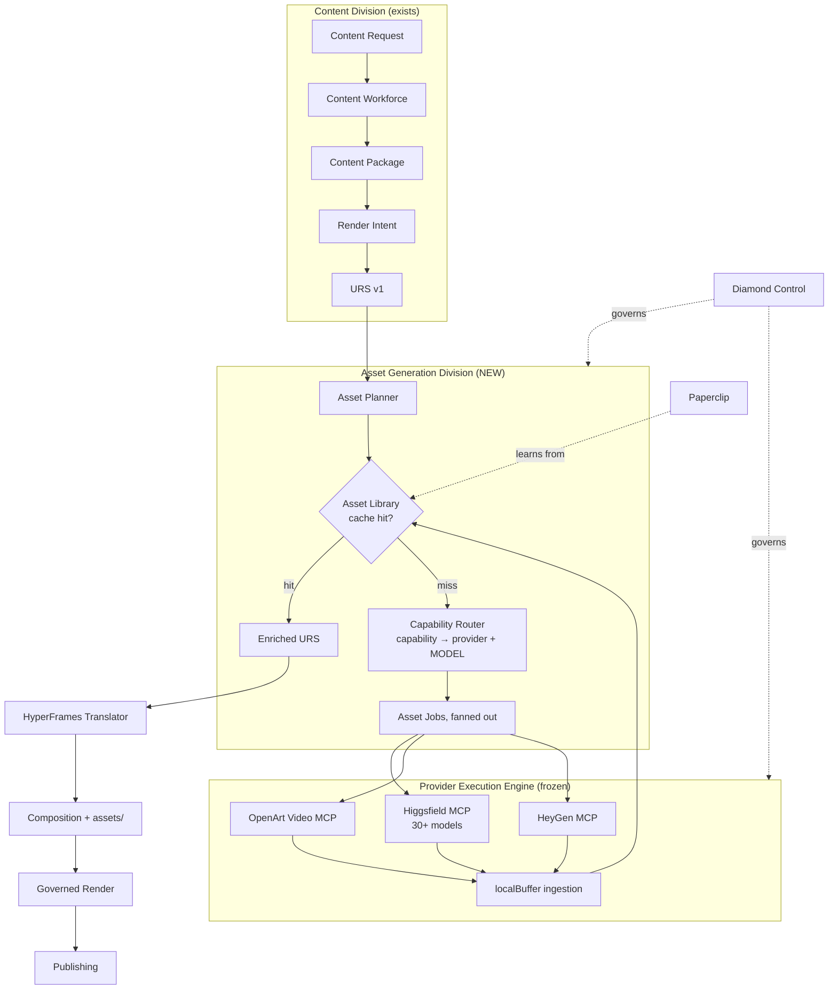
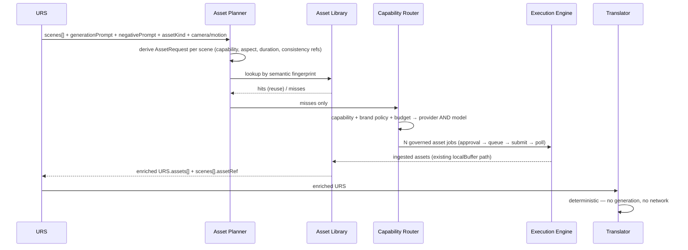

# Mika OS — Supercomputer Integration Audit

**Architecture review · 2026-08-06 · No code, no implementation**

---

## 0. The finding that changes the brief

The milestone asks how to integrate **Higgsfield Supercomputer** as an "AI Creative Asset Worker — the creative cinematographer" beneath Mika's Content Division.

Verification says that is not what Supercomputer is.

> "Higgsfield Supercomputer is an agentic AI that runs your whole creative pipeline… a full AI creative team in one chat. You describe what you want to make — a reel, an ad, a product shot, a week of content — and Supercomputer **plans it, picks the right models and presets, and delivers the finished asset**… with long-term memory that remembers your brand."

Read that against Mika's own pipeline — Content Request → Research → Workforce → Package → Render Intent → URS → Translation → Narrated Video → Publishing.

**Supercomputer is not a component that fits under the Content Division. It is a competing implementation of the Content Division.** It plans, routes to models, remembers brand, and delivers finished assets. That is Mika's product thesis, sold as a chat box.

Three consequences:

1. **There is no Supercomputer API or MCP to integrate.** Higgsfield's developer surface is **Higgsfield MCP** — a *model access* layer. Supercomputer is a consumer chat product. Searching Higgsfield's own MCP/CLI documentation surfaces model generation tools; nothing exposes the Supercomputer agent itself. Integrating it would mean driving someone's chat UI.
2. **Mika already has the useful half.** Higgsfield MCP — already merged and governed — fronts **30+ models including Soul, Cinema Studio, Flux, Seedream, Kling, Minimax Hailuo, and Veo**. The cinematographer you want is already wired in.
3. **The instinct behind the brief is exactly right, and better than the title.** "Teach Mika to intelligently use the providers it already has" is precisely the gap. The thing to build is *Supercomputer-class orchestration inside Mika* — not an integration with Supercomputer.

**Recommendation: do not integrate Higgsfield Supercomputer. Build the Asset Generation Division that makes Mika the supercomputer, dispatching to the Higgsfield MCP already merged.**

The rest of this document answers the eleven questions on that basis, and flags where an answer changes because of it.

---

## 1. Executive architecture review

Mika's pipeline is, today, **semantically rich and visually empty**.

The P0–P3 milestones proved the spine end to end: a real workforce run produced a real package, a provider-neutral URS carried 97% of render intent, a deterministic translator produced a runnable composition, and a governed render emitted a narrated 1080×1920/30fps/45s MP4 through the existing Execution Engine.

What that video actually shows is gradient placeholders.

The URS knows what every scene should look like. Scene 0 carries:

```
visual.description      "A cluttered desk with various automation tools scattered around."
visual.generationPrompt "A cluttered desk with various automation tools, including a laptop,
                         papers, and coffee cup, in a well-lit modern office setting."
visual.negativePrompt   "No people, no mess, clean desk."
visual.assetKind        "video"
camera                  "Close-up on the desk, then zoom out to show the whole workspace."
motion                  "Slow pan across the desk."
```

That is a complete, model-ready generation brief — for all seven scenes. Nothing consumes it. The translator carries it into `render-data.json` as metadata and renders a CSS gradient.

**The gap is not capability. It is dispatch.** Mika can describe a shot and can render a timeline. It cannot yet turn a description into a shot.

---

## 2. Current state

### What exists and works

| Layer | State |
|---|---|
| Provider Execution Engine | Queue, locks, retry, reconciliation, `localBuffer` ingestion. Frozen, correct. |
| Higgsfield MCP adapter | `generate_image`, `generate_video`, `image_to_video`, `job_status`, `models_explore`. Modes: `cinematic_broll`, `product_demo`, `image_to_video`. |
| Higgsfield model catalog | `models_explore` already surfaced via `/api/production/providers/higgsfield/models` with a live picker. **30+ models reachable.** |
| URS v1 | Provider-neutral, versioned, normalized. Already models `assets[]` with `role`/`kind`, and per-scene `generationPrompt`/`negativePrompt`/`assetKind`. |
| Translator | Deterministic, allowlisted, security-hardened. |
| Artifact store | `production-artifacts/<Brand>/<jobId>/<hash>.<ext>` |

### The five structural gaps

**G1 — There is no Asset.** Mika's only output noun is a job-scoped **artifact**: the terminal deliverable of one Production Job. `productionArtifactStore` exposes `saveProductionArtifact`, `findProductionArtifactPath`, `getProductionArtifact`, `listProductionArtifactsForJob` — everything keyed by job. There is no content hashing, no dedup, no reuse. An asset is conceptually the opposite of an artifact: an *input*, reusable across many jobs.

**G2 — A Production Job is 1→1.** One package, one provider, one render, one artifact. A 7-scene video needing 7 clips has no representation. There is no fan-out and no join.

**G3 — Routing is provider-level, not model-level.** The Router picks `hyperframes` vs `higgsfield` vs `openart`. But Higgsfield MCP alone fronts Kling, Veo, Seedream, Flux, Cinema Studio. **The decision that actually determines output quality — which *model* renders this shot — is currently a human dropdown.**

**G4 — URS `assets[]` is write-only.** It is populated (thumbnail, when one exists) and never read. The translator ignores it; the faceless-short template has no image or video layer.

**G5 — No consistency primitive.** Nothing carries a character, a product, or a brand look across scenes or across videos. `referenceArtifactIds` exists on the Higgsfield adapter and nothing produces references to put in it.

---

## 3. Recommended architecture

### 3.1 Where it lives — **D: Asset Generation Division**

Evaluating the five options:

| Option | Verdict |
|---|---|
| **A. Provider** | **No.** Higgsfield is *already* a provider. Adding "Supercomputer" as a second Higgsfield provider duplicates the adapter and still leaves the real gap — nothing decides *what* to generate. |
| **B. Creative Asset Worker** | Right instinct, wrong scope. A single worker cannot own planning, fan-out, dedup, and consistency. This is the *unit* inside the division, not the division. |
| **C. Content Workforce stage** | **No.** The Workforce is model-call-shaped: prompt in, JSON out, `createStageWorker`. Asset generation is long-running, costly, external, and must go through the governed Execution Engine. Forcing it into a stage either bypasses execution governance or corrupts the stage contract. |
| **D. Asset Generation Division** | **Recommended.** |
| E. Something else | Only as a later evolution — see §11. |

**The Asset Generation Division sits between URS and Translation.** It reads a URS, decides what visual assets each scene needs, dispatches generation to existing provider adapters through the existing Execution Engine, collects the results into a reusable Asset Library, and hands back a URS whose `assets[]` is populated.

Why this and not the others:

- **It preserves URS neutrality.** The division consumes and returns URS. The contract does not change; `assets[]` simply stops being empty.
- **It reuses the Execution Engine unmodified.** Every generation is a normal governed job — approval, budget, retry, ingestion. No second execution path, which is the mistake that would be hardest to undo.
- **It is the only placement where fan-out is natural.** One URS → N asset jobs → one enriched URS → one render. Fan-out cannot live inside a 1→1 Production Job or a synchronous workforce stage.
- **It puts model routing somewhere.** Today no component owns "which model should shoot this?" The division does.

### 3.2 System diagram



### 3.3 Data flow



**Critical ordering: generation happens BEFORE translation, always.**

### 3.4 Should HyperFrames ever ask Supercomputer for missing assets?

**No — and this is the single most important boundary in the design.**

The translator's value is that it is *pure and deterministic*: same URS + same template version → same composition ID, byte-identical output. That property is what makes the composition hash meaningful, caching safe, and renders reproducible.

Letting the translator request generation would:
- make it non-deterministic (network, cost, latency inside a pure transform)
- make it capable of spending money — a function currently safe to call in a validator loop
- invert the dependency (compositor → cinematographer), creating a cycle
- destroy the content-hash contract, since output would depend on external state

**Rule: the translator consumes assets, never requests them.** If an asset is missing at translation time, the translator does what it does today — renders the placeholder and reports it in `degradedFields`. Honest degradation, not a hidden purchase.

---

## 4. What Supercomputer *is*, in production-department terms

Since the brief asks for this framing explicitly:

| Department | Supercomputer | Where Mika stands |
|---|---|---|
| Creative director | Plans the piece from a one-line brief | Mika has this (Workforce + Review) |
| Cinematographer | Picks models/presets, shoots | **Mika's gap** — but reachable via Higgsfield MCP |
| Brand memory | "Remembers your brand" long-term | Mika's gap — Paperclip's natural home |
| Editor/compositor | Assembles the deliverable | Mika has this (HyperFrames, and it is *better* — deterministic, seek-safe, governed) |
| Governance | None exposed | **Mika's advantage** — approval, budget, audit, artifact provenance |

**Strengths (verified):** end-to-end generation from natural language; 30+ models behind one interface; brand memory; app generation.

**Limitations (verified or reasoned):** a chat product with no exposed agent API; opaque routing (you cannot audit why a model was chosen); no per-step approval or budget gate; output lands in Higgsfield's system, not Mika's artifact store with provenance; credits are consumed by an agent you do not control.

**That last point is decisive.** Mika's differentiator is governance — every generation approved, budgeted, attributed, reproducible. Delegating to an opaque agent trades away the exact property the last four milestones were spent building.

---

## 5. Job routing

### 5.1 What should route to Higgsfield MCP

Its verified surface is `generate_image`, `generate_video`, `image_to_video` across 30+ models.

| Capability | Route | Why |
|---|---|---|
| Cinematic b-roll | Higgsfield (video model) | Already a supported mode (`cinematic_broll`) |
| Luxury product shots | Higgsfield (Soul / Seedream image) | Still-image strength; feeds `image_to_video` |
| Lifestyle / fashion / beauty | Higgsfield video | Model breadth covers aesthetic range |
| Background plates | Higgsfield image | Cheap, cacheable, highly reusable |
| Camera moves | Higgsfield video | Its differentiator; URS already carries `camera`/`motion` |
| Establishing / brand reveal | Higgsfield video | |
| Still → motion | Higgsfield `image_to_video` | Already a supported mode |
| Motion reference | Higgsfield video, short | Reference, not final |

### 5.2 What should never route there

| Never | Route to | Why |
|---|---|---|
| Talking head / avatar / lip-sync | **HeyGen** | Purpose-built; URS `presenter` block already maps to it. A generic video model cannot do reliable lip-sync. |
| Typography, kinetic text, captions, lower-thirds | **HyperFrames** | Must be legible, frame-exact, deterministic. Never generate text as pixels — it will be misspelled, unsearchable, and unfixable. **This is the hardest rule in the document.** |
| Timeline assembly, transitions, scene sequencing | **HyperFrames** | Compositor's job. A generative model cannot hit a 45.0s timeline. |
| Narration audio | **Narration service** | Local, $0, deterministic |
| Music | **Nothing** | Nothing upstream produces music intent. Do not fabricate it. |
| Logos, exact brand marks, UI screenshots | **Real assets / HyperFrames** | Generative models approximate; brand marks must be exact. |
| Anything with on-screen legible text | HyperFrames overlay | Same as typography |

**The governing principle: generate the *world*, composite the *message*.** Higgsfield shoots the room. HyperFrames writes the words.

---

## 6. Asset Library

### 6.1 Why it cannot be the artifact store

The existing store is job-scoped and terminal: `production-artifacts/<Brand>/<jobId>/<hash>.<ext>`, with no content hashing for identity, no dedup, no reuse, and `listProductionArtifactsForJob` as the only enumeration. An asset is the inverse — an *input*, reused across jobs, brands, and months.

**Do not retrofit reuse into the artifact store.** It is load-bearing for a frozen execution path. Add a sibling.

### 6.2 Design

```
data/assets/
  index.json                     capability + fingerprint → assetId
  <assetId>.json                 record (provenance, cost, lineage, quality, usage)
assets-library/
  <brand>/<capability>/<assetId>/
    source.<ext>                 the generated file
    preview.jpg
```

**Asset record shape** (illustrative, not an API):

```
assetId, capability, brandId
semanticFingerprint      normalized prompt + negative + aspect + duration + model + version
contentHash              bytes
provenance               provider, model, providerJobId, productionJobId, promptHash, generatedAt
cost                     credits, usd, confirmed|provisional
lineage                  derivedFromAssetId (image → image_to_video), consistencyGroupId
quality                  operatorRating, reviewVerdict, usageCount, lastUsedAt
policy                   brandApproved, retentionClass
```

**Two-tier identity — the key design decision.**

- `contentHash` answers "are these the same bytes?"
- `semanticFingerprint` answers "would regenerating this produce an equivalent asset?"

Generative models are non-deterministic, so content hashing alone can never yield a cache hit. The semantic fingerprint is what actually saves money, and it is deliberately *lossy*: it should hit for prompts that differ only in irrelevant wording. Exposing near-miss candidates for operator confirmation beats silent reuse.

**Consistency groups** are how a character, product, or environment persists. Assets sharing a `consistencyGroupId` reuse the same reference images through the adapter's existing `referenceArtifactIds`. This is the primitive that makes "the same presenter in scene 1 and scene 5" possible, and it needs no new provider.

**Retention:** references and background plates are long-lived; one-off b-roll for a single video is not. Without a retention class this directory becomes unbounded — generated video is large, and the narration WAV already showed how fast local media accumulates.

---

## 7. Future compatibility

The roadmap names Runway, Kling, Veo, Pika, Luma, Flow, and future image generators.

**Most of that list is already reachable.** Higgsfield MCP fronts Kling, Veo, Seedream, Flux, Minimax Hailuo and more. Building separate provider adapters for them would duplicate an integration Mika already has.

This is the reframe that makes the whole design future-proof:

> **The routing dimension Mika is missing is MODEL-level, not PROVIDER-level.**

The Capability Router must resolve **capability → (provider, model)** as a pair. Adding Veo becomes a catalog entry, not an adapter. A genuinely new provider (Runway direct, Luma) is then an *additional path to a capability*, and the router's contract does not move.

Two rules keep this true:
1. **Capabilities are Mika's vocabulary, not a provider's.** `cinematic_broll`, `product_still`, `background_plate`, `motion_reference` — never `kling_v2_pro`.
2. **The catalog is data, discovered where possible.** `models_explore` already returns live model metadata. Prefer discovery over hardcoded lists.

---

## 8. Mission Control

Mission Control is the executive OS, not a provider dashboard. The unit of attention should be **work and money**, not services.

```
CONTENT
  Ideas · Create · Produce · Perform          (from the earlier strategy audit)

PRODUCTION
  Creative Queue      packages awaiting asset planning
  Generation Queue    asset jobs in flight — capability, provider, MODEL, cost, ETA
  Render Queue        compositions rendering
  Publishing Queue    finished, awaiting publish
  Asset Library       browse / search / reuse / approve, with cache-hit rate

GOVERNANCE (Diamond Control)
  Budget              spend by brand, capability, provider, model
  Provider Health     existing
  Asset Approvals     brand compliance gate
```

Three metrics deserve first-class placement because they are the ones that will actually change behavior:

- **Cache hit rate** — the direct measure of whether the Asset Library is paying for itself
- **Cost per finished video**, split generation vs render vs narration
- **Credits remaining** — Higgsfield credits are consumable and prepaid (≈$1 per 16 credits, 150/month free tier). Running out mid-campaign is a foreseeable, preventable failure.

Notably, the Generation Queue must show the **model**, not just the provider. "Higgsfield" is not actionable; "Higgsfield · Kling 2.5 · 6s · 12 credits" is.

---

## 9. Paperclip integration

**Yes — but as a later phase, and only in one direction at first.**

The Asset Library will accumulate exactly the signal Paperclip should learn from: which prompts produced approved assets, which models won for which capability, which camera moves recur in high-performing videos, which brand looks stayed consistent.

Sequencing matters:

- **Phase 1 (with the division): record.** Every asset already carries prompt, model, cost, and operator rating. Recording is nearly free and creates the dataset.
- **Phase 2 (after ~100 assets): suggest.** Paperclip proposes a model or prompt pattern; the router may take it as a *hint*, never as an override.
- **Phase 3 (after real performance data): learn from outcomes.** Requires the attribution spine from the earlier strategy audit — which does not exist yet. Without published-performance data, "best-performing visual style" is unmeasurable.

**Do not build Phase 3 now.** Learning from success requires a definition of success, and Mika still has no attribution. Building the loop before the signal produces confident nonsense.

---

## 10. Diamond Control

Diamond Control should own the decisions that cost money or carry brand risk. It should **not** own the ones that are mechanical.

| Diamond Control owns | Rationale |
|---|---|
| Budget ceilings per brand / campaign / job | Fan-out multiplies spend — 7 scenes is 7× one clip |
| Provider + model routing policy | "This brand uses Soul for stills"; router proposes, policy constrains |
| Brand compliance gate on assets | Generated imagery can be off-brand or unsafe in ways text is not |
| Retry policy | A retried generation is a *second purchase*, unlike a retried render |
| Cost optimization | Cheaper model for drafts, premium for finals |
| Provider confidence | Downgrade a model that keeps failing review |

| Should NOT be a gate | Rationale |
|---|---|
| Per-asset human approval by default | 7 scenes × 3 variants = 21 gates per video. This is how the pipeline dies. Gate the *batch*, sample the assets. |
| Quality scoring as a blocker | Score and surface; only block on brand/safety |

The earlier audit found one video passing **six** approval surfaces. Asset generation could trivially add twenty more. **Design the batch gate before the first asset is generated, not after.**

---

## 11. Long-term hierarchy

The proposed hierarchy is close, with one correction:

```
Mission Control            ← surface, not a layer
  Boardroom                 strategy
  Diamond Control           governance  ─┐
  Content Division                       │ governs laterally,
    Creative Director                    │ not a parent in the
    Asset Division            ←──────────┘ execution chain
      Capability Router
      Asset Library
  Provider Workers          Higgsfield · OpenArt · HeyGen · future
  HyperFrames               compositor
  Publishing
```

Two corrections to the proposed chain:

1. **Diamond Control is not a layer in the execution path.** Putting it between Boardroom and Content Division implies every creative action passes through it, which recreates the approval-fatigue problem structurally. It is a *cross-cutting policy plane* that constrains the Asset Division and Execution Engine — it should not be something work flows *through*.

2. **The Asset Division belongs under the Content Division, not beside it.** Assets exist to serve content. A standalone Asset Division invites asset generation for its own sake — which is exactly how you end up with a large, expensive library and no published videos.

Otherwise the hierarchy is sound, and notably **it does not require a Supercomputer node** at any level.

---

## 12. Folder structure

Additive; nothing existing moves.

```
lib/production/assets/
  assetCapabilities.js      capability vocabulary (Mika's, not a provider's)
  assetPlanner.js           URS → AssetRequest[]
  capabilityRouter.js       capability → (provider, model) + policy
  assetLibraryStore.js      fs-backed, sibling to productionArtifactStore
  assetFingerprint.js       semantic fingerprint + content hash
  assetRules.js             pure: validation, cost policy, retention

data/assets/                records + index   (gitignored)
assets-library/             binaries          (gitignored)

scripts/validate-asset-planner.mjs
scripts/validate-capability-router.mjs
scripts/validate-asset-library.mjs
```

Conventions to preserve, because they have held for four milestones: pure `*Rules.js` importable from both server and client; fs-backed stores with strict id allowlists and traversal rejection; one executable validator per subsystem; binaries and runtime records gitignored.

---

## 13. Risks

| Risk | Severity | Mitigation |
|---|---|---|
| **Cost fan-out.** 7 scenes × variants × retries, each a real purchase | **High** | Batch budget ceiling before dispatch; cache-first; cheap draft models |
| **Approval fatigue.** 20+ new gates per video | **High** | Batch gate, not per-asset. Decide before building. |
| **Quality disappointment.** Generated b-roll may look worse than the current honest gradient | **Medium** | Ship behind a per-scene opt-in; keep placeholders as fallback |
| **Character inconsistency.** Different face per scene reads as broken | **Medium** | Consistency groups from day one via `referenceArtifactIds` |
| **Library unbounded growth.** Generated video is large | **Medium** | Retention classes at design time |
| **Credit exhaustion mid-campaign** | **Medium** | Surface credit balance in Mission Control; pre-flight check |
| **Determinism loss.** Generation inside translation | **High** | Hard boundary — translator never generates (§3.4) |
| **Rebuilding Supercomputer badly** | **High** | Don't. Route to models, don't re-implement an agent. |

---

## 14. Things NOT to build

1. **A Supercomputer provider adapter.** No agent API exists; it duplicates Higgsfield MCP.
2. **Separate adapters for Kling / Veo / Seedream / Flux.** Already reachable through Higgsfield MCP. Route by *model*.
3. **Generation inside the translator.** Destroys determinism and the composition-hash contract.
4. **A second execution engine.** Asset jobs are normal governed jobs.
5. **Text or logos as generated pixels.** HyperFrames owns anything legible.
6. **Music.** Nothing upstream produces music intent; never fabricate it.
7. **Per-asset approval gates by default.**
8. **Paperclip performance learning now.** No attribution spine exists to learn from.
9. **Reuse retrofitted into `productionArtifactStore`.** Add a sibling.
10. **A general workflow/DAG engine.** Fan-out → join for assets is a bounded, specific need.
11. **Speculative capabilities.** `models_explore` is live; discover, don't hardcode.

---

## 15. Priority order

Ordered by *fastest path to a video that looks like something*, not architectural completeness.

**M1 — Prove one generated scene end to end.**
Take scene 0's existing `generationPrompt` + `negativePrompt`, dispatch one Higgsfield `generate_image` job through the existing engine, drop it behind the headline in the faceless-short template. No planner, no library, no router. **This validates the whole thesis for the price of one image**, and will surface the real integration problems the way M0 did.

**M2 — Asset Library + fingerprinting.**
Before fan-out, because generating 7 clips with no cache is how the first surprising bill happens.

**M3 — Asset Planner (URS → AssetRequest[]).**
Fan-out for all scenes, batch budget gate, translator consumes `assets[]`.

**M4 — Capability Router (capability → provider + model).**
The quality unlock. Only meaningful once M1–M3 prove assets flow.

**M5 — Consistency groups.**
Character/product/environment persistence via `referenceArtifactIds`.

**M6 — Mission Control surfaces.**
Generation Queue, Asset Library browser, credits, cache-hit rate.

**M7 — Diamond Control policy plane.**
Per-brand model policy, retry policy, brand compliance gate.

**M8 — Paperclip recording** (not learning).

M1 is deliberately tiny. The pattern that has worked across M0–P3 is: run the smallest real thing, let it fail honestly, fix what actually broke. The corrupted `.next` cache, the review deadlock, the font-lint abort, and the validator that deleted a live composition were all found that way — none would have been predicted by design.

---

## Summary

Do not integrate Higgsfield Supercomputer. It has no agent API, and it is a competing implementation of the division Mika has spent four milestones building.

Build the **Asset Generation Division** between URS and Translation: an Asset Planner that reads render intent Mika already produces, a Capability Router that resolves capability → provider **and model**, and an Asset Library that makes generation cacheable and consistent — all dispatching through the frozen Execution Engine to the Higgsfield MCP already merged.

The cinematographer is already hired. Mika just has to learn to direct.

---

**Sources**
- [Higgsfield Supercomputer](https://higgsfield.ai/supercomputer)
- [Higgsfield Supercomputer — intro](https://higgsfield.ai/supercomputer-intro)
- [Higgsfield MCP](https://higgsfield.ai/mcp)
- [How to Access Higgsfield via CLI and Skills](https://higgsfield.ai/creator-hub/help-center/mcp-cli/how-do-i-access-higgsfield-via-cli)
- [Higgsfield MCP: Sora, Veo, Kling from Claude Code](https://claudefa.st/blog/tools/mcp-extensions/higgsfield-mcp)
